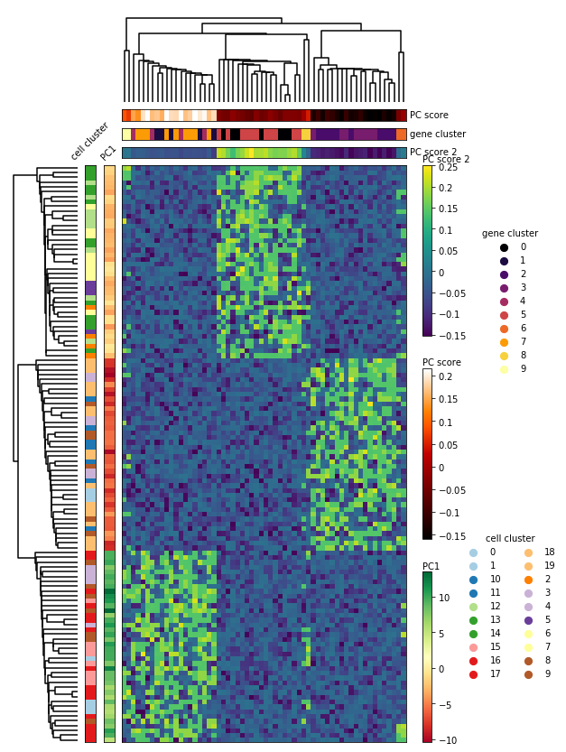

# nheatmap
Inspired by pheatmap in R, this plotting tool aims to enable multi-level heatmap with the option to perform hierarchical clustering. The goal is to develop a python plotting package that is both intuitive in usage and extensive in plotting configuration.



## Requirements
- `python >= 3.5`
- `matplotlib >= 3.0.3`
- `scipy >= 1.3.1`
- `numpy >= 1.17.2`
- `pandas >= 0.25.1`

## Installation
- Option 1 via pip:
```bash
pip install nheatmap
```

- Option 2 via github:
```bash
git clone https://github.com/xuesoso/nheatmap
```
Include the cloned directory as part of the python path

## Usage
- [Check here](https://github.com/xuesoso/nheatmap/blob/master/tutorial.ipynb) for a tutorial on usage.

## To-do
- [X] Documentation of the code
- [ ] Cutting of heatmap
- [ ] Bottom panel plots
- [ ] Enable usage of AnnData structure
- [ ] Highlight individual rows / columns

## Other plotting tools
- [DensityPlot](https://github.com/xuesoso/DensityPlot)
