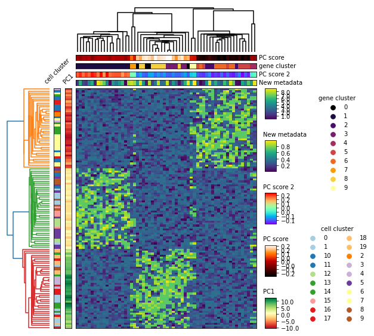

# nheatmap
Inspired by pheatmap in R, this plotting tool aims to enable multi-level heatmap with the option to perform hierarchical clustering. The goal is to develop a package that is both intuitive in usage and extensive in plotting configuration.
    

## Requirements

## Installation

## Usage

## Help

